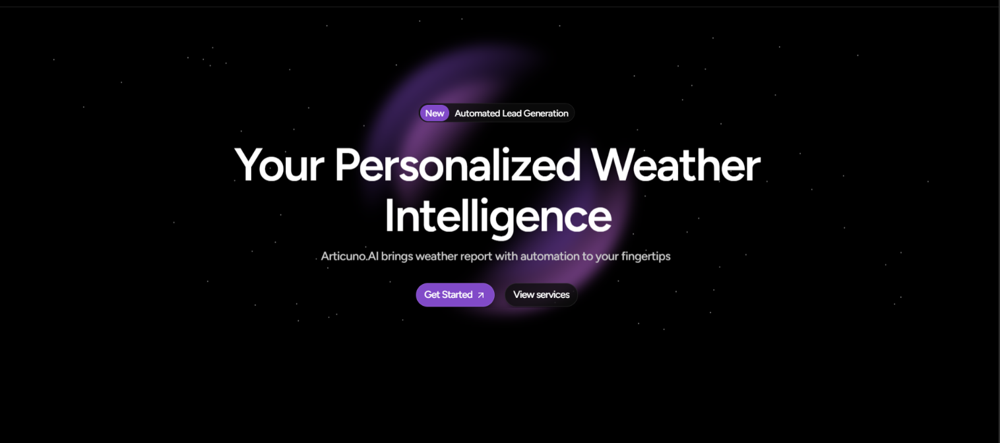

## 🤖🪄 Articuno.AI v1.0 - "Interact. Innovate. Inspire with AI"

 
Articuno V1.0 is an AI powered platform where user can interact with different generative AI including advanced LLMs GPT-40, DeepSeek, Gemini 2.0 Flash, Mistral AI and many more.

## 🌟 Features 
- 🌦️ **Intelligent Weather Agent** - Get real-time weather updates, forecasts, and emergency alerts powered by OpenWeatherMap API.

- 📧 **Seamless Integrations** - Works with Gmail and Slack to deliver weather reports exactly when and where you need them.

- 📞 **Emergency Alerts** - With Twilio integration, Articuno.AI can call you with a recorded voice alert during severe weather, ensuring you're always prepared.

- 🧠 **Advanced AI Models** - Interact with various LLMs like GPT-40, DeepSeek, Gemini 2.0 Flash, Mistral AI, and more.

- 🔗 **GitHub PAT Integration** - Seamless model access through GitHub Personal Access Tokens.

- 🧩 **Basic AI models** - Included to boost productivity.

- 🚀 **User-friendly UI** - Modern dark theme with an intuitive design.

- 🪶 **Flexible Architecture** - Lightweight website developed with Flask.

## 🛠️ Technologies Used
- **Frontend:** HTML, CSS, JavaScript
- **Backend:** Python (Flask)
- **Database:** FlaskSQL
- **Authentication:** GitHub PAT Integration
- **APIs:** OpenWeatherMap, Twilio, Gmail, Slack
- **Deployment:** TBD

## 🧠 Available AI Models 

### 🤖 Agents
- **Articuno.AI:** Your intelligent weather assistant powered by Gemini, providing real-time forecasts, emergency alerts, and seamless integration with Gmail, Slack, and Twilio. 🌦️

- **Bikram.AI:** Your friendly Full-stack Developer companion! Built with the personality of Bikram Mondal, specializing in web development, React, Node.js, Three.js, and helping you learn through errors. Let's build amazing things together! 🚀

- **Wikipedia DeepSearch:** Quick access to Wikipedia knowledge with instant article summaries and information retrieval. 📚

### 🧠 AI Assistants
- **GPT-4o:** OpenAI's flagship model with advanced multimodal capabilities for text, vision, and code generation. 💡

- **GPT-4o-mini:** Efficient and cost-effective variant of GPT-4o with strong performance across tasks. ⚡

- **DeepSeek R1:** Open-weight reasoning model optimized for complex problem-solving and coding tasks. 🐳

- **DeepSeek V3:** Advanced 671B parameter model with superior reasoning and comprehensive capabilities. 🚀

- **Gemini 2.0 Flash:** Google's fast-response multimodal LLM with excellent balance of speed and quality. ✨

- **Gemini 2.5 Flash:** Latest Gemini model with enhanced reasoning and multimodal understanding capabilities. 🌟

- **Grok-3:** xAI's powerful 314B parameter model with real-time information access and advanced reasoning. 🧠

- **Grok-3 Mini:** Compact version of Grok-3 optimized for faster responses while maintaining quality. ⚡

- **Ministral 3B:** Mistral AI's compact 3B parameter model optimized for edge deployment and efficiency. 🪶

- **Codestral 2501:** Mistral AI's specialized 22B parameter model designed for code generation and technical tasks. 💻

## ⚙️ Installation

1. Clone the repository:
```bash
git clone https://github.com/BikramMondal5/Articuno.AI.git
```

2. Navigate to the project directory:
```bash
cd Articuno.AI
```

3. Install dependencies
```bash
pip install -r requirements.txt
```
   
4. Configure API Keys
   - Create a `.env` file with the following keys:
   ```
   OPENWEATHER_API_KEY=your_openweather_api_key
   GEMINI_API_KEY=your_gemini_api_key
   TWILIO_ACCOUNT_SID=your_twilio_sid
   TWILIO_AUTH_TOKEN=your_twilio_token
   ```

5. Run `python app.py`

6. Open your web browser and go to `http://127.0.0.1:5000/` to interact with AI models.

## ☎️ Contact
For any queries or feedback, feel free to reach me at `codesnippets45@gmail.com`. 

## 🤝 Contributing
Contributions are welcome! Feel free to open an issue or submit a pull request to enhance Articuno.AI.

## 📜 License
This project is licensed under the `MIT License`.
